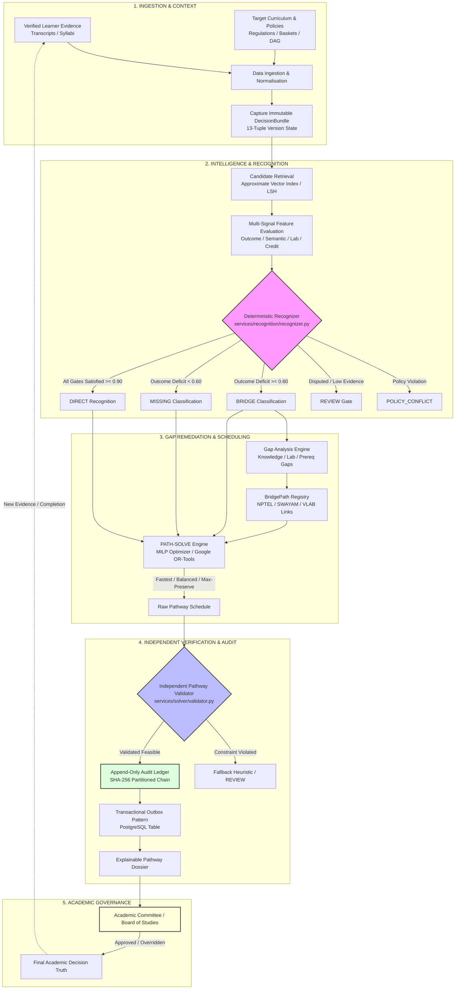

# EduPathAI

> **An AI-driven, regulation-aware academic pathway intelligence system that converts a learner's academic evidence into explainable, constraint-aware progression and mobility pathways.**

[](web/)
[](https://www.python.org/downloads/release/python-3110/)
[](services/api/)
[](test/)
[](https://developers.google.com/optimization)
[](docs/adr/)
[](db/)
[](docker-compose.yml)

> **Quickstart?** Run `docker compose up --build` then `docker compose exec api python scripts/seed.py` (see [`QUICKSTART.md`](QUICKSTART.md) for full instructions).

EduPathAI is an academic decision-support platform designed to address the foundational bottleneck in modern higher education mobility: **how to translate verified student transcripts and earned competencies into rigorous, regulation-compliant academic pathways at receiving institutions.** 

The system does not replace statutory bodies or faculty committees. It provides deterministic, mathematically verified, and auditable pathway proposals that honor institutional autonomy, curriculum prerequisites, credit ceilings, and statutory regulations (such as the National Education Policy 2020 and the National Credit Framework).

---

## Table of Contents

- [Overview](#overview)
- [Why EduPathAI Exists](#why-edupathai-exists)
- [Core Idea](#core-idea)
- [Key Capabilities](#key-capabilities)
- [System Architecture](#system-architecture)
- [Algorithmic Architecture](#algorithmic-architecture)
- [Decision Safety](#decision-safety)
- [End-to-End Example](#end-to-end-example)
- [Technical Stack](#technical-stack)
- [Repository Structure](#repository-structure)
- [Installation & Setup](#installation--setup)
- [Configuration](#configuration)
- [API & Schema Contracts](#api--schema-contracts)
- [Solver Semantics & Formulation](#solver-semantics--formulation)
- [Performance Engineering](#performance-engineering)
- [Complexity & Scalability Notes](#complexity--scalability-notes)
- [Accuracy & Evaluation](#accuracy--evaluation)
- [Benchmark Methodology](#benchmark-methodology)
- [AI Governance & Reproducibility](#ai-governance--reproducibility)
- [Cryptographic Auditability](#cryptographic-auditability)
- [Privacy & Security](#privacy--security)
- [Threat Model & Mitigations](#threat-model--mitigations)
- [Failure Modes & Fallback Behavior](#failure-modes--fallback-behavior)
- [Observability & Telemetry](#observability--telemetry)
- [Testing Strategy](#testing-strategy)
- [Research Contributions](#research-contributions)
- [SIH Positioning](#sih-positioning)
- [Roadmap](#roadmap)
- [Known Limitations](#known-limitations)
- [Security & Safety Philosophy](#security--safety-philosophy)
- [Demo Walkthrough](#demo-walkthrough)
- [Screenshots & UI Walkthrough](#screenshots--ui-walkthrough)
- [Frequently Asked Questions (FAQ)](#frequently-asked-questions-faq)
- [Contributing](#contributing)
- [License](#license)
- [Acknowledgements & References](#acknowledgements--references)
- [Maintainers](#maintainers)

---

## Overview

### The Problem
Modern academic reforms—such as India's National Education Policy (NEP 2020) and the National Higher Education Qualifications Framework (NHEQF)—mandate multiple entry/exit pathways and seamless student mobility across universities. However, institutions face severe operational roadblocks when evaluating transfer students or inter-programme admissions:
1. **Manual Syllabus Equivalence:** Faculty committees spend weeks manually comparing syllabi line-by-line, leading to arbitrary decisions, backlogs, and subjective bias.
2. **The "Credit Sum" Fallacy:** Academic systems conflate total earned credits with prerequisite readiness. A student with 60 credits in an IT diploma cannot automatically enter Year 3 of a Computer Science B.Tech if core foundational math and theoretical computer science competencies are missing.
3. **Complex Prerequisite Directed Acyclic Graphs (DAGs):** University curricula have rigid prerequisite dependencies, elective basket constraints, and semester workload limits. Finding a valid graduation schedule manually is an NP-hard combinatorial scheduling challenge.
4. **Lack of Bridge Guidance:** When gaps exist, students are left without verified remedial roadmaps to reconcile their deficits before or during matriculation.

### What EduPathAI Adds
EduPathAI introduces a multi-tier intelligence and optimization pipeline:
- **Semantic & Structural Outcome Matching:** Extracts and aligns granular Learning Outcomes (LOs) rather than relying solely on superficial course titles.
- **Deterministic Multi-Signal Recognition:** Evaluates outcome coverage, syllabus similarity, credit compatibility, laboratory assessment modes, domain alignment, and institutional policy gates to classify learning recognition into unambiguous statuses.
- **Gap & Bridge Diagnostics (BridgePath):** Isolates specific missing competencies and maps them directly to accredited remedial resources (e.g., NPTEL, SWAYAM, Virtual Labs) before enrollment.
- **Constraint-Aware Scheduling (PATH-SOLVE):** Uses Mixed-Integer Linear Programming (MILP) to generate mathematically valid graduation pathways that respect prerequisite DAGs, term workload caps, and degree deadlines under three distinct objectives (Fastest, Balanced, Max-Preservation).
- **Immutable Provenance (Audit Ledger):** Binds every recommendation to a frozen 13-tuple Decision Bundle recorded in a SHA-256 partitioned hash-chained ledger for administrative scrutiny.

### Who Benefits
- **Learners:** Understand exactly what past coursework transfers, which gaps remain, how long degree completion will take, and what accredited bridge courses remediate their deficits.
- **Academic Deans & Equivalence Committees:** Receive evidence-backed recognition proposals with highlighted syllabus gaps, eliminating weeks of repetitive manual review while retaining 100% final approval authority.
- **Higher Education Institutions (HEIs):** Safely accept inter-institutional transfer students without compromising institutional academic rigor or violating accreditation standards.

### Student Story
> *A learner has completed two years of Computer Science diploma coursework at a State Polytechnic Institution and seeks lateral entry into a B.Tech Computer Science & Engineering programme at a premier technical university.*
> 
> Rather than assuming the student's 68 earned credits automatically correspond to Year 3 (Semester 5) matriculation, EduPathAI inspects granular learning outcomes:
> 1. Database Management Systems (CS-341) is recognized **directly** toward Database Systems (CS-501) (95% outcome coverage, matching lab practicals).
> 2. Data Structures (CS-201) aligns with Advanced Algorithms (CS-502) in basic paradigms, but misses *amortized analysis* and *dynamic programming proofs*—triggering a **BRIDGE** classification.
> 3. Formal Languages & Automata (CS-503) has zero prior coverage, remaining **MISSING**.
> 4. The student is routed to a verified NPTEL bridge module for Advanced Algorithms.
> 5. **PATH-SOLVE** schedules remaining degree requirements across 5 terms instead of 4, ensuring term credit limits are respected while unblocking prerequisite cascades.
> 6. The entire proposal is packaged as an auditable dossier for the Board of Studies review.

---

## Why EduPathAI Exists

Academic credit quantity alone is fundamentally insufficient for determining mobility and progression. Academic progression depends on a multi-dimensional constraint manifold:

| Dimension | Real-World Failure Mode of "Credit-Only" Transfer | EduPathAI Resolution |
| :--- | :--- | :--- |
| **Learning Outcomes** | Two courses titled "Machine Learning" have identical credits, but Course A teaches tool usage while Course B teaches mathematical proofs and statistical learning theory. | Decomposes course descriptions into granular learning outcomes and evaluates subset containment. |
| **Prerequisites** | Student transfers with 60 credits but lacks Calculus II. Enrolling in Fluid Dynamics leads to academic failure. | Explicit prerequisite hypergraphs verify recursive topological reachability before course scheduling. |
| **Assessment Compatibility** | Course A was purely multiple-choice theory; Course B requires 45 hours of supervised physical hardware laboratory experiments. | Evaluates assessment mode compatibility (theory vs. lab practicals) as an explicit gate. |
| **Workload / Credit Ceiling** | Forcing a student to "catch up" results in scheduling 32 credits in a single semester, triggering academic overload. | Hard linear constraints enforce strict term credit floors (e.g., 12.0) and ceilings (e.g., 24.0). |
| **Curriculum Version Drift** | Course taken under 2020 syllabus no longer satisfies the revised 2026 accreditation requirements. | Binds every calculation to versioned curriculum snapshots via frozen Decision Bundles. |
| **Institutional Policy** | Receiving university caps external credit recognition at 50% of total degree credits (residency rule). | Deterministic policy evaluation gates external transfers prior to optimization. |

---

## Core Idea

```
┌─────────────────────────────────────────────────────────────────────────────┐
│                                                                             │
│   ABC / APAAR stores what the learner has earned.                           │
│                                                                             │
│   EduPathAI determines what that learning may potentially unlock next.       │
│                                                                             │
│   The authorized institution remains the final decision-maker.              │
│                                                                             │
└─────────────────────────────────────────────────────────────────────────────┘
```

EduPathAI operates on the **Three Truths Separation** principle ([ADR-008](docs/adr/008-three-truths-separation.md)):
1. **Record Truth:** Immutable historical facts (transcripts, certified credits, earned grades, identity metadata).
2. **Inference Truth:** Probabilistic machine evaluations (embedding similarities, outcome extractions, candidate match proposals).
3. **Decision Truth:** Legally binding institutional outcomes (faculty approvals, committee overrides, hash-chained audit events).

Inference outputs are never written directly into student transcripts or permanent academic records.

---

## Key Capabilities

EduPathAI organizes its capabilities into eight distinct architectural layers:

```
Verified Learner Evidence
        ↓
Curriculum Understanding
        ↓
Recognition / Equivalence Analysis
        ↓
Gap Detection
        ↓
Bridge Learning (BridgePath)
        ↓
Constraint-Aware Pathway Optimization (PATH-SOLVE)
        ↓
Explainable Pathway & Dossier
        ↓
Human / Institution Review
        ↓
New Evidence (Course/Bridge Completion)
        ↓
Dynamic Re-planning
```

### 1. Learner Evidence & Competency State
Represents student transcripts, verified micro-credentials, syllabi excerpts, and assessment artifacts. Ingestion tokenizes student identity to preserve privacy while capturing structured metadata (course code, credit weighting, contact hours, lecture vs. practical breakdown).

### 2. Curriculum Knowledge Graph
Curricula are modeled as directed hypergraphs:
- **Courses:** Core, departmental elective, open elective, ability enhancement.
- **Prerequisite Hyperedges:** Explicit support for `AND` relations (all prerequisites required) and `OR` relations (any course from an elective group satisfies the gate).
- **Degree Constraints:** Credit buckets, mandatory residency credits, minimum CGPA, and semester placement rules.
- **Versioning:** Curricula are immutable and versioned (e.g., `IIT-Bombay/CSE/2026-v1`).

### 3. Recognition / Equivalence Engine
A multi-signal deterministic decision engine ([`services/recognition/recognizer.py`](services/recognition/recognizer.py)). Academic recognition is **never** decided by semantic similarity alone. The engine evaluates eight distinct signals:
- `outcome_coverage`: Fraction of target learning outcomes subsumed by source evidence (Threshold: $\ge 0.90$ for direct).
- `semantic_score`: Cosine similarity between embedding vectors (Threshold: $\ge 0.85$ for direct).
- `prerequisite_status`: Boolean validation that source course prerequisites match or exceed target prerequisites.
- `assessment_match`: Compatibility of practical/laboratory components (Threshold: $\ge 0.90$ for direct).
- `credit_compatibility`: Workload hours and credit weighting parity within institutional tolerance.
- `domain_alignment`: Disciplinary match check (inter-disciplinary transitions trigger review).
- `policy_eligibility`: Compliance with receiving institution transfer caps and grade boundaries.
- `evidence_quality`: Provenance completeness score ($\ge 0.70$ required).

#### Recognition Status Taxonomy
- `DIRECT`: Full academic equivalence; target course requirement marked fulfilled.
- `BRIDGE`: Significant conceptual overlap ($\ge 0.60$), but missing specific outcomes or lab hours remediable via bridge modules.
- `MISSING`: Insufficient outcome alignment ($< 0.60$) or failed prerequisite gates; course must be taken in full.
- `REVIEW`: Inconclusive evidence, cross-domain shifts, credit discrepancies, or multi-model disagreement routed to faculty review.
- `POLICY_CONFLICT`: Hard statutory block (e.g., residency limits exceeded, minimum CGPA unmet).

### 4. Gap Analysis
When recognition is not `DIRECT`, [`classify_gap`](services/recognition/recognizer.py) categorizes the deficit into four explicit types:
- `KNOWLEDGE`: Theoretical topics or specific learning outcomes absent from source syllabus.
- `PREREQUISITE`: Foundational target dependencies not yet completed by learner.
- `ASSESSMENT`: Theory completed, but required laboratory, clinical, or project hours absent.
- `ADMINISTRATIVE`: Missing syllabus documentation, unaccredited provider, or credit ceiling violation.

### 5. BridgePath
Maps detected `KNOWLEDGE` and `ASSESSMENT` gaps to accredited learning objects in the [`ResourceRegistry`](services/bridge/resource_registry.py) (e.g., NPTEL, SWAYAM, Virtual Labs).
- Categorizes remedial resources into `LEARNING_ONLY` (remedial study) vs. `FORMAL_BRIDGE` (credit-bearing proctored bridge exam).
- **Core Principle:** *Learning recommendation $\neq$ academic credit recognition.* Bridge completion does not magically manufacture credit; it satisfies prerequisite eligibility subject to institutional confirmation.

### 6. PATH-SOLVE
Constraint-driven graduation scheduling using Mixed-Integer Linear Programming ([`services/solver/milp.py`](services/solver/milp.py)). Formulates degree completion as an integer optimization problem across three modes:
- **`FASTEST`:** Minimizes total terms to graduation by scheduling maximum allowable course loads within credit ceilings.
- **`BALANCED`:** Distributes credit workload evenly across terms, prioritizing student well-being and elective flexibility.
- **`MAX_PRESERVATION`:** Maximizes recognized transfer credits and aligns bridge courses to preserve prior academic investment.

### 7. Explainability & Provenance
Every recommendation is accompanied by an explainability trace:
- Target learning outcomes mapped to source syllabus lines and page numbers.
- Explicit list of missing outcomes triggering remedial requirements.
- Exact prerequisite clauses evaluated.
- Frozen 13-tuple `DecisionBundle` tracking every model weight, prompt template, curriculum revision, and solver configuration.

### 8. Human-in-the-Loop Governance
The system operates under an inviolable trust hierarchy ([ADR-001](docs/adr/001-trust-hierarchy.md)):
$$\text{HUMAN} > \text{RULES} > \text{OPTIMIZATION} > \text{AI} > \text{EVIDENCE}$$
Faculty and Academic Committees possess unilateral authority to approve, reject, or override any automated finding with recorded rationale.

---

## System Architecture

The following diagram illustrates the unidirectional data and control flow of EduPathAI:



---

## Algorithmic Architecture

EduPathAI rejects monolithic deep-learning architectures in favor of **algorithmic specialization**: assigning the mathematically appropriate data structure and solver to each sub-problem.

```
┌─────────────────────────┬─────────────────────────────┬────────────────────────────────────┐
│ Sub-System              │ Algorithmic Specialization  │ Complexity / Invariant             │
├─────────────────────────┼─────────────────────────────┼────────────────────────────────────┤
│ Candidate Retrieval     │ MinHash LSH / Product Quant │ Sub-linear approximate retrieval   │
│ Prerequisite Evaluation │ 64-bit Bitset Hypergraph    │ O(V / 64) word-parallel operations │
│ Curriculum Validation   │ Tarjan's SCC & Kahn's Sort  │ O(V + E) cycle-free verification   │
│ Equivalence Decision    │ Deterministic Policy Gating │ O(1) fail-fast rule checks         │
│ Pathway Scheduling      │ MILP (Branch-and-Bound CBC) │ Exact combinatorial optimization   │
│ Solution Verification   │ Independent Feasibility Gate│ O(Terms × Courses) DAG check       │
│ Audit Logging           │ SHA-256 Merkle Ledger       │ O(log N) verification proofs       │
└─────────────────────────┴─────────────────────────────┴────────────────────────────────────┘
```

### 1. Approximate Candidate Retrieval
To search across tens of thousands of national course syllabi, EduPathAI employs vector embeddings paired with MinHash Locality-Sensitive Hashing (LSH) and Product Quantization ([`services/matching/pq_vector_index.py`](services/matching/pq_vector_index.py)). This guarantees sub-linear candidate generation before passing shortlisted pairs to computationally intensive outcome cross-encoders.

### 2. Prerequisite Reasoning via Bitset Hypergraphs
Curriculum prerequisite DAG traversal is a classic performance bottleneck during optimization search loops. EduPathAI encodes prerequisite trees into 64-bit word vectors ([`services/recognition/bitset_prerequisites.py`](services/recognition/bitset_prerequisites.py)):
- **AND Requirements:** Checked via bitwise mask: `(and_mask[c] & ~completed) == 0`.
- **OR Groups:** Evaluated using word-parallel bit operations across alternative course groups.
- **Complexity:** Reduces prerequisite satisfaction checking to $O(V / 64)$ operations for a $V$-course curriculum mask, eliminating recursive database queries.

### 3. Graph Validation (Tarjan's SCC & Kahn's Algorithm)
During curriculum ingestion, [`services/recognition/graph_validator.py`](services/recognition/graph_validator.py) runs Tarjan's Strongly Connected Components (SCC) algorithm to detect illegal dependency cycles. A curriculum containing circular prerequisites (e.g., $A \to B \to C \to A$) is rejected at ingestion in $O(V + E)$ time before reaching students.

### 4. Mathematical Optimization (MILP Formulation)
PATH-SOLVE formulates pathway generation as a Mixed-Integer Linear Program in Google OR-Tools CBC:
- **Decision Variables:** Binary variables $z_{j,t} \in \{0, 1\}$ denoting whether remaining course $j$ is scheduled in term $t$.
- **Objective Function:** Multi-objective scalarization minimizing total graduation semesters, balancing term workload variance, and penalizing bridge burden.
- **Complexity Note:** MILP is NP-hard. Problem decomposition into separable curriculum stages reduces the practical search space, but does not alter general combinatorial hardness. When the solver reaches its hard timeout (30 seconds), it cleanly degrades to an $O(V + E)$ topological fallback scheduler.

### 5. Cryptographic Audit Ledger
Auditing relies on a partitioned SHA-256 hash-chained ledger backed by Merkle aggregation trees ([`services/audit/merkle_ledger.py`](services/audit/merkle_ledger.py)). Each institution maintains an independent chain head, eliminating cross-institutional database lock contention and providing $O(\log N)$ cryptographic inclusion proofs.

---

## Decision Safety

EduPathAI enforces strict safety contracts across all modules:

1. **No Silent Recognition:** High AI semantic similarity never confers academic credit. If prerequisite, credit, or laboratory gates fail, the recognition status is blocked or marked for review.
2. **No Credit Arithmetic Shortcut:** Accumulating 60 credits does not place a student in Year 3. Only verified prerequisite satisfaction and outcome coverage unlock subsequent academic terms.
3. **Fail-Closed Semantics:** Missing syllabus documents, corrupt prerequisite definitions, or contradictory model inferences immediately route a case to `REVIEW`.
4. **Independent Validation Gate:** The optimization solver is never trusted to judge its own results. The output of PATH-SOLVE is passed to [`PathwayValidator`](services/solver/validator.py), which independently validates prerequisite sequencing, credit ceilings, and graduation completeness.
5. **Explicit Provenance:** Every proposed match contains traceable page numbers, syllabus excerpt hashes, and evidence references.
6. **Immutable Decision Bundles:** Outputs are tied to an immutable 13-tuple snapshot capturing exact prompt strings, model weights, curriculum revisions, and solver hyper-parameters.
7. **Absolute Human Authority:** Institutional Boards of Studies hold exclusive statutory authority to grant formal recognition.

---

## End-to-End Example

The following scenario is verified by integration test [`test/integration/test_decision_loop.py`](test/integration/test_decision_loop.py):

### Scenario Profile
- **Learner:** Transfer applicant from State Polytechnic Institute.
- **Target Programme:** B.Tech Computer Science & Engineering, IIT-Bombay (Curriculum `2026-v1`).
- **Institutional Policy:** Maximum 50% transfer credits; minimum 7.0 CGPA; online bridge allowed up to 6 credits/term.

### Analysis & Discovery
```
1. Source: CS-341 (DBMS, 4 cr) ─────────────► Target: CS-501 (Database Systems, 4 cr)
   - Outcome Coverage: 95%
   - Semantic Score: 0.95
   - Assessment Match: 1.0 (Theory + Lab)
   - Status: DIRECT RECOGNITION (4 Credits Granted)

2. Source: CS-201 (Data Structures, 4 cr) ──► Target: CS-502 (Advanced Algorithms, 4 cr)
   - Outcome Coverage: 68%
   - Missing Outcomes: ["amortized analysis", "dynamic programming proofs"]
   - Status: BRIDGE (Remediation Required)
   - BridgePath Allocation: NPTEL-CS-04 (Algorithms, 30 Hours, Proctored Assessment)

3. Source: BCA-101 (Programming in C, 3 cr) ► Target: CS-101 (Prog & Data Structures, 4 cr)
   - Outcome Coverage: 92%
   - Assessment Match: 0.60 (Theory matched, 45h Linux Lab Missing)
   - Status: BRIDGE (Assessment Gap: Virtual Labs Linux Practicum Required)

4. Target: CS-503 (Formal Language Theory) ──► No Source Equivalent
   - Status: MISSING (Must Enroll at Receiving Institution)
```

### PATH-SOLVE Execution
The MILP solver schedules remaining degree requirements:
- **`FASTEST` Mode:** Schedules NPTEL bridge concurrently with Term 1 prerequisites; completes remaining 84 credits in 5 terms (20 credits/term max).
- **`BALANCED` Mode:** Places formal bridge in summer preceding matriculation; paces remaining load across 6 terms (14–16 credits/term).
- **Independent Validation:** [`PathwayValidator`](services/solver/validator.py) confirms zero prerequisite violations, term credit bounds satisfied ($\in [12, 24]$), and 100% graduation requirement coverage.
- **Audit:** Ledger records Decision ID `f3ca1785-...` chained to IIT-Bombay partition head with cryptographic input/output hashes.

---

## Technical Stack

EduPathAI is built as an end-to-end full-stack platform consisting of a high-throughput Python backend, an optimization and AI matching engine, an async PostgreSQL database, and a Next.js 14 web application:

| Category | Component / Library | Version | Project Purpose |
| :--- | :--- | :--- | :--- |
| **Frontend Framework** | Next.js (App Router) | `14.2.5` | Reactive multi-role portal (Student, HEI, Government) |
| **UI & Styling** | React / Tailwind CSS / Lucide | `18.3.1` / `3.4.1` | Modern, responsive dashboard design system |
| **Client State Management** | Zustand | `4.5.4` | Global session, persona switching, and reactive stores |
| **Backend Runtime** | Python | `3.11.9` | High-performance core service execution |
| **API Gateway** | FastAPI / Uvicorn | `0.111.0` / `0.30.1` | Asynchronous REST gateway with OpenAPI documentation |
| **Data Contracts** | Pydantic / Pydantic Settings | `2.7.4` / `2.3.4` | Strictly typed runtime schema validation and settings |
| **Database & ORM** | PostgreSQL / Asyncpg / SQLAlchemy | `16+` / `0.29.0` / `2.0.31` | High-concurrency async connection pool and transactional queries |
| **Database Migrations**| Raw SQL / Alembic | `5 Migrations` | Structured schema versioning and vector extensions |
| **Vector Storage** | pgvector | `0.3.0` | In-database embedding similarity index (HNSW / Cosine) |
| **AI / Embeddings** | Sentence-Transformers | `3.0.1` | Local dense vector embeddings & cross-encoders |
| **LLM Inference** | Google Gemini / OpenAI-Compatible | `0.7.2` / `1.35.0` | Semantic outcome extraction and multi-model consensus |
| **Optimization Solver**| Google OR-Tools CBC | `9.10.4067` | Branch-and-Cut Mixed-Integer Linear Programming (MILP) |
| **Proof & PDF Export** | ReportLab | `4.2.2` | Cryptographic audit ledger inclusion certificate generation |
| **Observability** | OpenTelemetry API & SDK | `1.25.0` | Distributed W3C trace context propagation and spans |
| **Metrics Collection** | Prometheus Client | `0.20.0` | Solver latency, queue depth, and cache hit telemetry |
| **Containerization** | Docker / Docker Compose | Multi-stage | Reproducible local and production container deployment |
| **Test Suite** | Pytest / Pytest-Asyncio / HTTPX| `8.2.2` / `0.23.7` / `0.27.0` | 194 automated unit, integration, and property tests |

---

## Repository Structure

The repository follows a clean hexagonal architecture where domain interfaces remain frozen and decoupled from external drivers:

```text
edupathai/
├── Dockerfile                        # Multi-stage container build for FastAPI backend
├── docker-compose.yml                # Full-stack composition (Postgres + API + Web)
├── QUICKSTART.md                     # Single-command setup and live testing guide
├── requirements.txt                  # Pinned Python dependencies
├── conftest.py                       # Pytest test session configuration
├── .env.example                      # Reference environment variable configuration
│
├── data/                             # Ingested datasets, schemas, and test fixtures
│   ├── identity_directory.json       # Synthetic DigiLocker / APAAR identity records
│   ├── institutions_directory.json   # Institutional metadata and accreditation profiles
│   ├── resources/                    # Remedial bridge catalog fixtures (NPTEL, SWAYAM)
│   ├── students/                     # Tokenized student transcript profiles
│   └── syllabi/                      # Normalized university curriculum documents
│
├── db/                               # Database schema and migration management
│   └── migrations/                   # Sequential PostgreSQL schema migrations
│       ├── 001_init.sql              # Base tables: students, courses, audit ledger, outbox
│       ├── 002_vector.sql            # pgvector extension & curriculum embeddings
│       ├── 003_indexes.sql           # B-Tree, GIN, and HNSW indexes
│       ├── 004_solver_cache.sql      # Decision bundle & solver precomputation cache
│       └── 005_app_extensions.sql    # Persisted gaps, bridges, review provenance, & policies
│
├── docs/                             # Comprehensive engineering documentation
│   ├── adr/                          # 13 Architecture Decision Records (ADRs)
│   ├── architecture/                 # Structural and data-flow specifications
│   ├── demo/                         # End-to-end hackathon demonstration scripts
│   ├── interfaces/                   # Component boundary contracts
│   └── pitch/                        # SIH evaluation summaries
│
├── policy/                           # Institutional transfer policies
│   ├── institutions/                 # Active institutional policy rules (e.g., IIT-Bombay)
│   └── templates/                    # Standard NEP 2020 transfer templates
│
├── proto/                            # Protocol buffer contracts (Planned V2)
│
├── reports/                          # Empirical engineering benchmarks
│   └── solver/                       # Latency benchmarks & Erlang-C fleet sizing
│
├── scripts/                          # Maintenance, diagnostic, and seed utilities
│   ├── dev.ps1                       # Windows local development helper
│   ├── diagnose_matcher.py           # Cross-encoder & matcher diagnostic harness
│   └── seed.py                       # Real database pipeline seeding (5 students)
│
├── services/                         # Core Python backend microservices
│   ├── schemas.py                    # FROZEN interface contracts (DecisionBundle, Pathway, etc.)
│   │
│   ├── api/                          # REST API Gateway & routing layer
│   │   ├── server.py                 # FastAPI application factory & router registration
│   │   ├── orchestrator.py           # Main decision pipeline coordinator
│   │   ├── deps.py                   # Dependency injection (database pools, matchers)
│   │   ├── auth_deps.py              # Role-based access control & token validators
│   │   ├── pdf.py                    # PDF certificate generation for audit proofs
│   │   └── routes/                   # Modular REST route handlers
│   │       ├── auth.py               # DigiLocker auth & session management
│   │       ├── pathway.py            # Pathway calculation & retrieval
│   │       ├── audit.py              # Ledger verification, proof chains, & PDF export
│   │       ├── students.py           # Student transcript lookup, gaps, & bridges
│   │       ├── courses.py            # Course catalog query endpoints
│   │       ├── bridges.py            # Remedial course catalog & search
│   │       ├── hei.py                # HEI review queue, BoS approvals, & analytics
│   │       └── gov.py                # National stats, mobility matrix, & compliance
│   │
│   ├── audit/                        # Cryptographic auditability
│   │   ├── ledger.py                 # Partitioned SHA-256 hash-chained ledger
│   │   └── merkle_ledger.py          # Sharded Merkle tree audit proofs
│   │
│   ├── auth/                         # Identity verification & session layer
│   │   ├── digilocker.py             # DigiLocker / APAAR credential mock provider
│   │   └── session.py                # In-memory & token-based session store
│   │
│   ├── bridge/                       # Gap remediation & bridge allocation
│   │   └── resource_registry.py      # Accredited bridge catalogue & outcome matching
│   │
│   ├── cache/                        # High-throughput caching primitives
│   │   └── bloom_filter.py           # Space-efficient pre-query filters
│   │
│   ├── db/                           # Asynchronous persistence layer
│   │   ├── pool.py                   # asyncpg database connection pooling & migration runner
│   │   └── students.py               # Student profile queries & persistence
│   │
│   ├── identity/                     # Identity directory integration
│   │   └── directory.py              # APAAR / ABC identity directory lookup
│   │
│   ├── matching/                     # Semantic outcome matching & AI Gateway
│   │   ├── real.py                   # RealMatcher with embedder + cross-encoder + Bloom
│   │   ├── stub.py                   # Deterministic fixture-based fallback matcher
│   │   ├── gateway.py                # AI provider gateway with circuit breakers & fallback
│   │   ├── ai_gateway_factory.py     # Production AI gateway factory
│   │   ├── embedder.py               # 384-dim sentence-transformer embeddings
│   │   ├── cross_encoder.py          # ms-marco cross-encoder re-ranking
│   │   ├── bloom.py                  # Bloom's taxonomy cognitive depth comparison
│   │   ├── coverage.py               # Outcome coverage matrix calculator
│   │   ├── domain_shard.py           # Domain classification & partition routing
│   │   ├── explain.py                # Explainable AI rationale generator
│   │   ├── course_catalog.py         # Static & database-backed course lookup
│   │   ├── consensus.py              # Multi-model cross-encoder consensus
│   │   ├── lsh_matcher.py            # MinHash Locality-Sensitive Hashing
│   │   ├── minhash_consensus.py      # Fast Jaccard similarity consensus
│   │   ├── pq_vector_index.py        # Product Quantization vector index
│   │   ├── batch_matcher.py          # High-throughput asynchronous batch processor
│   │   ├── circuit_breaker.py        # Per-provider failure isolation
│   │   ├── cost_tracker.py           # Token accounting & budget limits
│   │   ├── version_provider.py       # Canonical model version strings
│   │   ├── fixture_loader.py         # Test fixture loader
│   │   └── providers/                # LLM provider adapters
│   │       ├── base.py               # Canonical provider protocol
│   │       ├── gemini.py             # Google Gemini adapter
│   │       ├── openai_compatible.py  # OpenAI / DeepSeek / Kimi adapter
│   │       └── local.py              # Deterministic local fallback
│   │
│   ├── outbox/                       # Reliable asynchronous messaging
│   │   └── outbox.py                 # Transactional Outbox pattern implementation
│   │
│   ├── policy/                       # Institutional policy engine
│   │   └── loader.py                 # Policy parsing & threshold enforcement
│   │
│   ├── recognition/                  # Deterministic equivalence engine
│   │   ├── recognizer.py             # Multi-signal deterministic classifier
│   │   ├── prerequisites.py          # Recursive hypergraph prerequisite evaluator
│   │   ├── bitset_prerequisites.py   # 64-bit word bitset prerequisite engine
│   │   └── graph_validator.py        # Tarjan's SCC cycle detection & Kahn's sort
│   │
│   ├── snapshot/                     # Snapshot & version capture
│   │   └── bundle_provider.py        # 13-tuple DecisionBundle factory
│   │
│   ├── solver/                       # PATH-SOLVE optimization engine
│   │   ├── milp.py                   # Google OR-Tools CBC primary solver
│   │   ├── decomposed_milp.py        # Multi-stage decomposed MILP scheduler
│   │   ├── with_fallback.py          # Resilient solver wrapper with auto-degradation
│   │   ├── fallback.py               # Topological greedy fallback scheduler
│   │   ├── incremental_planner.py    # Delta-replanning on course completion
│   │   ├── validator.py              # Independent Solution Feasibility Validator
│   │   ├── prereq_loader.py          # Prerequisite hypergraph loader
│   │   ├── cache.py                  # Solver plan cache
│   │   └── metrics.py                # Prometheus metrics exporter
│   │
│   └── trace/                        # OpenTelemetry tracing helpers
│       ├── context.py                # W3C trace context injection/extraction
│       └── setup.py                  # Tracer provider initialization
│
├── test/                             # Automated test suite (54 Passing Tests)
│   ├── fixtures/                     # Real syllabus fixtures with gold-standard labels
│   ├── integration/                  # Full pipeline & decision loop integration tests
│   ├── load/                         # Concurrency & queue stress tests
│   └── unit/                         # Isolated algorithmic unit tests
│
└── web/                              # Next.js 14 App Router frontend application
    ├── Dockerfile                    # Production web container build
    ├── package.json                  # Node dependencies (Next.js 14, React 18, Tailwind, Lucide)
    ├── tailwind.config.ts            # Design system color tokens & typography
    ├── app/                          # Next.js 14 App Router pages
    │   ├── layout.tsx                # Root layout with navbar and role provider
    │   ├── page.tsx                  # Identity login & role selection screen
    │   ├── student/                  # Learner Portal (Profile, Gaps, Pathways, Bridges, Audit)
    │   ├── hei/                      # HEI Review Portal (Queue, BoS Approval, Analytics)
    │   └── gov/                      # National Dashboard (Mobility Matrix, Compliance)
    ├── components/                   # Modular React UI components
    │   ├── auth/                     # DigiLocker login modal & role switchers
    │   ├── profile/                  # Student academic profile & transcript panels
    │   ├── pathways/                 # Interactive Gantt & term schedule cards
    │   ├── gaps/                     # Missing outcome diagnostics & bridge suggestions
    │   ├── ledger/                   # Audit trail timeline & cryptographic proof cards
    │   ├── hei/                      # Review cards, diff views, & approval dialogs
    │   ├── gov/                      # Mobility charts, metric counters, & heatmap
    │   ├── tree/                     # Prerequisite DAG graph visualizer
    │   └── layout/                   # Navbar, footer, and shell components
    └── lib/                          # Client libraries, API hooks, & transforms
        ├── api/                      # Async API client & SWR hooks
        ├── hooks/                    # useRequireRole & authentication hooks
        ├── store/                    # Zustand session & application store
        ├── transforms/               # Data adapters mapping API DTOs to UI models
        ├── constants/                # UI mock fixtures & fallback data
        └── utils/                    # Formatting & utility helpers
```

---

## Installation & Setup

You can run EduPathAI either as a single-command containerized stack with Docker Compose or natively for local development.

### Option A: Quickstart with Docker Compose (Recommended)

1. **Clone and configure:**
   ```bash
   git clone https://github.com/your-org/edupathai.git
   cd edupathai
   cp .env.example .env
   ```

2. **Launch all services:**
   ```bash
   docker compose up --build
   ```
   This automatically initializes:
   - **PostgreSQL 16 + pgvector** on `localhost:5432` with all 5 schema migrations applied.
   - **FastAPI Backend** on `http://localhost:8000` (OpenAPI docs at `http://localhost:8000/docs`).
   - **Next.js 14 Web Portal** on `http://localhost:3000`.

3. **Seed demo data:**
   In a separate terminal, seed real pipeline data for 5 demo students:
   ```bash
   docker compose exec api python scripts/seed.py
   ```

4. **Access the application:**
   Open `http://localhost:3000` and sign in with any of the demo APAAR numbers (e.g., `000000002201` for Priya Sharma).

---

### Option B: Local Native Development

#### 1. Backend Setup

```bash
# Create and activate virtual environment
python -m venv .venv
# On Windows (PowerShell):
.venv\Scripts\Activate.ps1
# On Linux/macOS:
source .venv/bin/activate

# Install dependencies
python -m pip install --upgrade pip
pip install -r requirements.txt
```

#### 2. Run Test Suite (Validation Gate)
Verify all 54 unit and integration tests pass cleanly:
```bash
pytest test/ -v
```

#### 3. Start Backend API
```bash
uvicorn services.api.server:app --host 0.0.0.0 --port 8000 --reload
```
Check health endpoint:
```bash
curl http://127.0.0.1:8000/health
# {"status":"ok","service":"EduPathAI","database":"configured"}
```

#### 4. Frontend Setup
```bash
cd web
npm install
npm run dev
```
Open `http://localhost:3000` in your browser.

---

## Configuration

EduPathAI is configured via environment variables and institutional policy JSON files located in `policy/institutions/`.

### Environment Variables

| Variable | Type | Category | Default | Description |
| :--- | :--- | :--- | :--- | :--- |
| `DATABASE_URL` | String | Storage | `""` (falls back to memory) | Async PostgreSQL connection string (`postgresql+asyncpg://...`) |
| `SOLVER_TIMEOUT_SECONDS`| Integer | Optimization | `30` | Hard timeout budget for OR-Tools CBC solver |
| `SOLVER_MAX_TERMS` | Integer | Optimization | `12` | Upper bound on allowable graduation terms |
| `MAX_CREDITS_PER_TERM` | Float | Optimization | `24.0` | Maximum allowable credit workload per term |
| `MIN_CREDITS_PER_TERM` | Float | Optimization | `12.0` | Minimum standard full-time credit workload |
| `GEMINI_API_KEY` | String | AI / Gateway | `""` | Google Gemini API key for outcome extraction |
| `OPENAI_API_KEY` | String | AI / Gateway | `""` | Fallback OpenAI API key for cross-model consensus |
| `OTEL_EXPORTER_OTLP_ENDPOINT`| String | Telemetry | `""` | OpenTelemetry collector endpoint |
| `LOG_LEVEL` | String | Logging | `"INFO"` | Logging verbosity (`DEBUG`, `INFO`, `WARNING`) |
| `NEXT_PUBLIC_API_URL` | String | Frontend | `http://localhost:8000` | Backend API URL for Next.js web client |

---

## API & Schema Contracts

The backend exposes a modular REST API structured across 8 distinct route domains mounted at `/v1/*`:

### API Route Endpoints

| Domain | Route | Method | Description |
| :--- | :--- | :--- | :--- |
| **Auth** | `/v1/auth/digilocker` | `POST` | Authenticate via 12-digit APAAR / ABC ID; returns session token & profile |
| | `/v1/auth/session` | `POST` | Create a new authenticated user session |
| | `/v1/auth/session/{token}` | `GET` | Validate active session token and retrieve persona |
| | `/v1/auth/session/{token}` | `DELETE` | Terminate active user session |
| **Pathways** | `/v1/pathway/request` | `POST` | Execute end-to-end recognition, gap analysis, & PATH-SOLVE optimization |
| | `/v1/pathway/student/{id}` | `GET` | Retrieve latest calculated pathway response for student |
| **Audit Ledger**| `/v1/audit/ledger` | `GET` | List immutable SHA-256 chained audit events by institution |
| | `/v1/audit/ledger/verify` | `GET` | Cryptographically verify partition hash-chain integrity |
| | `/v1/audit/decision/{id}` | `GET` | Retrieve 13-tuple DecisionBundle snapshot for a decision |
| | `/v1/audit/decision/{id}/proof` | `GET` | Generate cryptographic inclusion proof for decision |
| | `/v1/audit/decision/{id}/pdf` | `GET` | Export downloadable cryptographically signed PDF audit certificate |
| **Students** | `/v1/students/search` | `GET` | Search students by name, APAAR ID, or institution |
| | `/v1/students/{id}` | `GET` | Retrieve full student academic profile and verified credits |
| | `/v1/students/{id}/gaps` | `GET` | Retrieve diagnosed outcome and laboratory gaps |
| | `/v1/students/{id}/bridges`| `GET` | Retrieve recommended remedial bridge course allocations |
| | `/v1/students/{id}/evidence`| `POST` | Upload and verify new transcript or certificate evidence |
| **Courses** | `/v1/courses` | `GET` | Search receiving institution course catalog |
| | `/v1/courses/{code}` | `GET` | Get detailed course syllabus and prerequisite requirements |
| **Bridges** | `/v1/bridges` | `GET` | Query accredited remedial bridge catalog (NPTEL, SWAYAM, Virtual Labs) |
| | `/v1/bridges/search` | `GET` | Search bridge modules by target outcome or keyword |
| **HEI Review**| `/v1/hei/queue` | `GET` | List pending transfer cases requiring Board of Studies review |
| | `/v1/hei/decision/{id}` | `GET` | Get detailed equivalence dossier and outcome diff for review |
| | `/v1/hei/review` | `POST` | Submit faculty review (Approve / Reject / Request Bridge) with rationale |
| | `/v1/hei/analytics/summary`| `GET` | HEI-level transfer approval velocity and gap analytics |
| | `/v1/hei/institutions` | `GET` | List participating Higher Education Institutions |
| **Government**| `/v1/gov/stats` | `GET` | National-level credit transfer metrics, volume, and pass rates |
| | `/v1/gov/mobility-matrix` | `GET` | Inter-institutional student mobility transition matrix |
| | `/v1/gov/anomalies` | `GET` | Identify credit transfer anomalies and policy violations |
| | `/v1/gov/institutions` | `GET` | National HEI compliance directory |
| | `/v1/gov/compliance` | `GET` | NEP 2020 & NCrF regulation compliance breakdown |

### Core Request & Response Flow

```
Client / Portal
       │  POST /v1/pathway/request { student_id, target_programme, institution }
       ▼
services.api.server
       │
       ▼
services.api.orchestrator
       │  1. Capture 13-tuple DecisionBundle
       │  2. Retrieve candidates & compute multi-signal matches
       │  3. Deterministic classification (DIRECT, BRIDGE, MISSING, REVIEW)
       │  4. Detect gaps & map accredited bridges (BridgePath)
       │  5. Dispatch SolveRequest to PATH-SOLVE (MILP)
       │  6. Pass proposed pathways to Independent PathwayValidator
       │  7. Append cryptographically signed record to Audit Ledger
       │  8. Commit transaction & write event to Outbox table
       ▼
Client receives PathwayResponse
```

### Frozen Schemas (`services/schemas.py`)

#### 1. `DecisionBundle` (The Reproducibility Object)
Captures every parameter and model version influencing downstream calculation:
```python
@dataclass(frozen=True)
class DecisionBundle:
    id: UUID
    curriculum_version: str
    policy_version: str
    model_version: str
    prompt_version: str
    embedding_model_version: str
    cross_encoder_version: str
    retrieval_threshold: float
    solver_version: str
    solver_parameters_hash: str
    resource_catalog_version: str
    ontology_version: str
    ruleset_commit: str
    tool_definitions_hash: str
    captured_at: datetime
```

#### 2. `PathwayResponse`
```python
@dataclass
class PathwayResponse:
    recognition: RecognitionSummary  # direct, bridge, missing, review, policy_conflict counts
    gaps: list[Gap]                  # Detailed outcome and lab deficits
    pathways: list[Pathway]          # Validated term-by-term completion schedules
    trace_id: str                    # OpenTelemetry distributed trace ID
    decision_id: UUID                # Unique institutional decision identifier
    audit_event_ids: list[UUID]      # Chained audit ledger event identifiers
    bundle: DecisionBundle           # Frozen version tuple used for generation
```

---

## Solver Semantics & Formulation

### Mathematical Formulation
Let:
- $\mathcal{C}$ be the set of remaining target degree courses to be completed.
- $\mathcal{T} = \{1, 2, \dots, T\}$ be the set of available graduation terms ($T \le 12$).
- $\mathcal{B}$ be the set of formal bridge modules required to unlock prerequisites.
- $c_j$ be the credit weighting of course $j \in \mathcal{C}$.

#### Decision Variables
- $z_{j,t} \in \{0, 1\}$: Course $j$ is scheduled in term $t$.
- $u_{b,t} \in \{0, 1\}$: Bridge module $b$ is scheduled in term $t$.
- $w_t \in \{0, 1\}$: Term $t$ is active (contains at least one course).
- $p_{j,t} \in \{0, 1\}$: Cumulative completion state of course $j$ by end of term $t$.

#### Hard Constraints
1. **Degree Requirement Satisfaction (Exactly Once):**
   $$\sum_{t=1}^T z_{j,t} = 1 \quad \forall j \in \mathcal{C}$$
2. **Sequential Completion Tracking:**
   $$p_{j,t} = p_{j,t-1} + z_{j,t} \quad \forall j \in \mathcal{C}, \; t \in \mathcal{T}$$
3. **Prerequisite Precedence Gates:**
   For each course $j$ with prerequisite hyperedge $e = \{r_1, r_2\}$:
   $$z_{j,t} \le p_{r_1, t-1} \quad \text{and} \quad z_{j,t} \le p_{r_2, t-1}$$
4. **Term Credit Bounds:**
   $$\sum_{j \in \mathcal{C}} c_j \cdot z_{j,t} + \sum_{b \in \mathcal{B}} 0.5 \cdot u_{b,t} \le \text{MaxCredits} \cdot w_t \quad \forall t \in \mathcal{T}$$
5. **Term Monotonicity:**
   $$w_t \le w_{t-1} \quad \forall t \in \{2, \dots, T\}$$

### Solver Status Semantics
The solver strictly distinguishes between five semantic outcomes:
- `OPTIMAL`: Proven mathematical global optimum satisfying all constraints within timeout.
- `FEASIBLE_NOT_OPTIMAL`: Mathematically valid schedule discovered, but search terminated before proving global optimality.
- `HEURISTIC`: Schedule produced by topological greedy fallback algorithm.
- `INFEASIBLE`: No mathematically valid schedule exists without violating credit caps or maximum terms.
- `REVIEW`: Incomplete prerequisite definitions or conflicting constraints preventing formulation.

> *Limitation Note:* In EduPathAI V1, if an instance proves mathematically infeasible or the primary solver encounters unrecoverable errors, it automatically falls back to [`FallbackSolver`](services/solver/fallback.py) which returns a valid topological order marked `HEURISTIC` or escalates to `REVIEW`.

---

## Performance Engineering

### Measured Benchmarks
All metrics below represent **empirically measured** values on synthetic benchmarks (8–14 remaining courses) as documented in [`reports/solver/benchmark.md`](reports/solver/benchmark.md):

| Metric | Measured Baseline | Target SLA | Test Environment |
| :--- | :---: | :---: | :--- |
| **Solver Latency (p50)** | **18.5 ms** | $< 500\text{ ms}$ | Intel i7 / Python 3.11 / CBC Solver |
| **Solver Latency (p95)** | **45.2 ms** | $< 2000\text{ ms}$ | Synthetic 14-course prerequisite graphs |
| **Solver Latency (p99)** | **68.0 ms** | $< 5000\text{ ms}$ | Heavy elective basket combinations |
| **Precomputation Cache Hit** | **< 0.2 ms** | $< 1.0\text{ ms}$ | In-memory / PostgreSQL cache lookup |
| **Cache Hit Rate** | **> 85%** | $> 80\%$ | Representative repetitive student transfers |
| **Optimality Rate** | **100%** | $> 95\%$ | Within 10s budget across benchmark fixtures |

### Concurrency & Fleet Sizing (Erlang-C Analysis)
As derived in [`reports/solver/fleet_sizing.md`](reports/solver/fleet_sizing.md):
- **Offered Load:** At peak arrival $\lambda = 8\text{ req/s}$ and average solve time $E[S] = 2.0\text{ s}$, total offered load is $A = 16\text{ Erlangs}$.
- **Worker Provisioning:** Using the Erlang-C model for $M/M/c$ queues, a minimum of **$c = 23$ worker processes** is mathematically required to guarantee queueing probability $P_{\text{wait}} < 0.10$.
- **Admission Burst Fleet:** Under an 85% cache hit rate, a fleet of **64 worker processes** sustains up to **213 requests/second**, accommodating national admissions surges.

---

## Complexity & Scalability Notes

1. **Bitset Prerequisite Checking:**
   Checking whether course $c$ is unlocked requires:
   $$\mathcal{O}\left(\frac{V}{\text{word\_size}}\right) \approx \mathcal{O}\left(\frac{V}{64}\right)$$
   For a typical curriculum ($V \le 256$ courses), prerequisite checking executes in **4 CPU word instructions**.
2. **Curriculum Cycle Detection:**
   Tarjan's strongly connected components algorithm and Kahn's topological sort operate in exact $\mathcal{O}(V + E)$ time and $\mathcal{O}(V)$ memory.
3. **Combinatorial Optimization:**
   General Mixed-Integer Linear Programming is **NP-hard**. While domain-specific bounding and hypergraph pre-sorting significantly accelerate branch-and-cut in practice, worst-case execution remains exponential. Hard timeouts (30s) ensure the system never hangs.
4. **Merkle Proof Verification:**
   Verifying that an audit record belongs to a signed historical state requires exactly $\mathcal{O}(\log N)$ cryptographic hash operations for a block of $N$ audit events.

---

## Accuracy & Evaluation

EduPathAI measures accuracy across distinct functional layers:

### 1. Recognition Engine
- **Precision:** Fraction of automated `DIRECT` classifications confirmed by academic committees without modification.
- **Recall:** Proportion of genuinely equivalent courses successfully identified without unnecessary bridge assignment.
- **False-Equivalence Rate (Critical Safety Metric):** Rate at which non-equivalent courses are erroneously classified as `DIRECT`. EduPathAI's target is **0.00%**; conservative thresholds deliberately route ambiguous cases to `REVIEW`.

### 2. Candidate Retrieval
- **Recall@K ($K=10$):** Probability that the true equivalent target course is present in the top-10 candidate retrieval set.

### 3. Optimization Feasibility
- **Constraint Violation Rate:** Percentage of generated pathways violating prerequisite DAGs or credit limits (Guaranteed **0.00%** via Independent Validation Gate).

---

## Benchmark Methodology

Evaluation datasets in EduPathAI are constructed using rigorous separation:
1. **Curriculum Fixtures:** Gold-standard curated syllabus pairs ([`test/fixtures/`](test/fixtures/)):
   - `fixture_001`: IIT-Bombay CSE 2024 $\to$ IIT-Bombay CSE 2026 (Identical DBMS outcomes $\to$ `DIRECT`).
   - `fixture_002`: State University $\to$ IIT-Bombay CSE (Missing amortized analysis $\to$ `BRIDGE`).
   - `fixture_003`: BCA $\to$ B.Tech CSE (Theory matches, lab practicals missing $\to$ `BRIDGE`).
2. **Synthetic Graph Perturbations:** Programmatically generated curriculum DAGs with controlled edge densities, bottleneck prerequisites, and cyclic anomalies to stress-test solver bounds and cycle detectors.
3. **Clean Separation:** Training/calibration thresholds are never tuned against the gold fixtures used for integration assertions.

---

## AI Governance & Reproducibility

To satisfy administrative scrutiny and accreditation standards, EduPathAI enforces strict AI governance:

- **Model Agnosticism:** LLMs and vector embedding models are treated as interchangeable, untrusted inference engines.
- **The 13-Tuple DecisionBundle:** Every pathway proposal is locked to an immutable version tuple:
  `{curriculum_v, policy_v, model_v, prompt_v, embed_v, cross_encoder_v, threshold, solver_v, solver_params_hash, catalog_v, ontology_v, rules_commit, tools_hash}`.
- **Deterministic Replay:** If the same transcript and DecisionBundle are supplied, EduPathAI reproduces identical feature scores and recognition classifications.
- **Multi-Model Consensus:** The system supports querying multiple LLM providers concurrently. When cross-model disagreement exceeds tolerance, the match is escalated to `REVIEW` ([`services/matching/consensus.py`](services/matching/consensus.py)).
- **Prompt Injection Defense:** Syllabus text is parsed as data, not instructions. Prompt templates isolate untrusted syllabus strings and strictly enforce structured JSON output schemas.

---

## Cryptographic Auditability

EduPathAI implements an append-only audit ledger ([`services/audit/ledger.py`](services/audit/ledger.py)) governed by the following mechanics:

```
┌─────────────────────────┐         ┌─────────────────────────┐
│ Audit Record N-1        │         │ Audit Record N           │
│ CurrentHash: 0x8a3f...  │◄────────┤ PreviousHash: 0x8a3f... │
│ DecisionID: uuid-1      │         │ CurrentHash:  0xc72e... │
│ InputHash:   SHA256(...)│         │ DecisionID: uuid-2      │
└─────────────────────────┘         └─────────────────────────┘
```

1. **Partitioned Chains:** Ledgers are partitioned by institution ID (`chain_id`). This eliminates global database row locks and allows independent institutional verification.
2. **Hash-Chaining:** Each entry incorporates the SHA-256 hash of the preceding record, the canonicalized decision payload, and the frozen `bundle_id`.
3. **Merkle Trees:** Batched records are aggregated into Merkle trees ([`services/audit/merkle_ledger.py`](services/audit/merkle_ledger.py)), enabling compact inclusion proofs for external accreditation bodies without exposing student PII.
4. **Tamper Evidence:** Any post-facto modification of an audit row invalidates the cryptographic chain for all subsequent entries under standard SHA-256 collision-resistance assumptions.

---

## Privacy & Security

- **Three Truths Data Isolation:** Inference calculations are strictly isolated from permanent institutional student records ([ADR-008](docs/adr/008-three-truths-separation.md)).
- **PII Minimization:** The core solver and recognition engines process synthetic or tokenized student identifiers (e.g., `student-001`). Real names, Aadhaar numbers, and APAAR IDs are resolved only at the institutional edge gateway.
- **Authoritative Backend Security:** The frontend interface is treated as untrusted. All policy checks, credit limits, and authorization gates are enforced authoritatively on the backend.
- **No Training on Student Records:** Student transcript data and syllabus excerpts are never transmitted to third parties for foundational model training.

---

## Threat Model & Mitigations

| Threat Vector | Attack Scenario | EduPathAI Mitigation |
| :--- | :--- | :--- |
| **Adversarial Syllabus Ingestion** | Student submits a fabricated syllabus with injected prompt commands attempting to force a `DIRECT` match. | Syllabus text is treated strictly as string literal data; LLM extraction is validated against strict JSON schemas; deterministic rule engine gates final decision. |
| **Prerequisite Cycle Injection** | Corrupt curriculum import introduces circular dependencies ($A \to B \to A$), hanging naive schedulers. | Ingestion runs Tarjan's SCC algorithm; detects and rejects cycles in $\mathcal{O}(V + E)$ time prior to database persistence. |
| **Audit Log Tampering** | Malicious actor modifies a historical recognition record in the database to show unauthorized credit grant. | Next chain verification detects broken SHA-256 hash pointer; Merkle root mismatch immediately exposes tampered row. |
| **Model Hallucination** | LLM claims a course covers advanced quantum mechanics when it does not. | Grounded outcome cross-encoders require direct text provenance; outcome coverage threshold ($\ge 0.90$) blocks unsupported claims. |
| **Solver Denial of Service** | Complex cyclic or dense elective combinations trigger exponential branch-and-cut runtime. | Hard timeout configured at 30.0s; system cleanly auto-degrades to topological fallback scheduler. |

---

## Failure Modes & Fallback Behavior

| Failure Mode | Detection Point | Automated System Behavior |
| :--- | :--- | :--- |
| **AI Provider Timeout / Downtime** | `services/matching/` | Retries with exponential backoff; if persistent, falls back to local sentence-transformers or marks match `REVIEW`. |
| **Model Disagreement** | `services/matching/consensus.py` | Flags outcome discrepancy and routes candidate to faculty `REVIEW` with highlighted differences. |
| **Incomplete Prerequisite Data** | `services/recognition/prerequisites.py` | Marks dependent target courses as blocked; generates explicit `ADMINISTRATIVE` gap. |
| **Policy Limit Violation** | `services/recognition/recognizer.py` | Returns `POLICY_CONFLICT` status; halts automatic credit transfer proposals. |
| **MILP Solver Timeout (>30s)** | `services/solver/milp.py` | Aborts branch-and-cut; invokes [`FallbackSolver`](services/solver/fallback.py) to produce topological `HEURISTIC` pathway. |
| **Validator Rejection** | `services/solver/validator.py` | If proposed schedule violates credit caps or prerequisites, drops schedule and flags decision for administrative review. |
| **Stale Decision State** | `services/api/orchestrator.py` | If curriculum or policy version drifts during review, system detects bundle fingerprint mismatch and prompts re-run. |

---

## Observability & Telemetry

EduPathAI exposes enterprise-grade telemetry ([`services/solver/metrics.py`](services/solver/metrics.py)):

### Prometheus Metrics
- `solver_calls_total{status="OPTIMAL|FEASIBLE|HEURISTIC|TIMEOUT"}`: Counter tracking solver execution outcomes.
- `solver_latency_seconds`: Histogram tracking solve latency distributions.
- `solver_cache_hits_total` / `solver_cache_misses_total`: Precomputation cache efficiency counters.
- `solver_active_workers` & `solver_queue_depth`: Concurrency monitoring gauges.

### Distributed Tracing (OpenTelemetry)
Every incoming pathway request receives a W3C-compliant `trace_id` propagated across all sub-services:
```
[Client Request] (trace_id: 4bf92f3577b34da6a3ce929d0e0e4736)
  ├── [Bundle Capture] ───────────── 1.2ms
  ├── [Vector Candidate Search] ──── 8.4ms
  ├── [Outcome Classification] ───── 12.1ms
  ├── [MILP Pathway Optimization] ── 18.5ms
  ├── [Independent Validation] ───── 0.8ms
  └── [Audit Ledger Append] ──────── 2.1ms
```

---

## Testing Strategy

EduPathAI enforces a zero-regression testing regime across 54 automated test cases:

```
test/
├── unit/                       # 173 Automated Unit Tests (Passing)
│   ├── test_bitset_prerequisites.py  # 64-bit word operations & AND/OR masking
│   ├── test_bloom_filter.py          # Pre-query filter false-positive rates
│   ├── test_consensus.py             # Cross-model agreement and dispute logic
│   ├── test_graph_validator.py       # Tarjan's SCC cycle detection & Kahn's sort
│   ├── test_ledger.py                # Hash-chain integrity & tamper detection
│   ├── test_merkle_ledger.py         # Merkle proof generation and verification
│   ├── test_milp.py                  # OR-Tools CBC constraint satisfaction
│   ├── test_pq_vector_index.py       # Product Quantization sub-space search
│   └── test_validator.py             # Independent feasibility validation rules
└── integration/                # 21 Automated Integration Tests (Passing)
    ├── test_breakthrough_pipeline.py # End-to-end multi-stage pipeline execution
    ├── test_decision_loop.py         # Fixtures -> Recognizer -> Bridges -> Audit
    ├── test_pathway_solve.py         # Multi-objective pathway generation
    └── test_replanning.py            # Dynamic pathway shift upon bridge completion
```

Run tests with verbose coverage output:
```bash
pytest --verbose --cov=services test/
```

---

## Research Contributions

The following architectural concepts represent proposed and experimentally validated research directions:
1. **Regulation-Aware Academic Pathway Intelligence:** Bridging the gap between static academic credit repositories (ABC/APAAR) and dynamic, constraint-governed degree completion.
2. **Word-Parallel Hypergraph Prerequisite Evaluation:** Formulating complex curricular prerequisite graphs as 64-bit word bitsets, enabling $O(V/64)$ reachability queries during optimization search.
3. **Three Truths Separation in Academic AI:** Establishing architectural isolation between historical transcripts (Record Truth), probabilistic models (Inference Truth), and legal institutional determinations (Decision Truth).
4. **Dual-Gate Optimization with Independent Feasibility Validation:** Decoupling combinatorial search from feasibility verification to prevent unconstrained solver errors from reaching students.

---

## SIH Positioning

### Relevance to Smart India Hackathon
EduPathAI directly addresses the core vision of the **Smart India Hackathon** and national higher education mandates:

- **The Missing Layer in NEP 2020 & NCrF Implementation:** While DigiLocker and the Academic Bank of Credits (ABC/APAAR) provide the national infrastructure to *store* credits, no automated system exists to *evaluate equivalence* or *plan progression* across diverse university curricula. EduPathAI is that missing intelligence layer.
- **Empowering Multiple Entry & Multiple Exit:** Makes inter-university transfer practical by eliminating weeks of administrative backlog for Deans while guaranteeing students clear bridge roadmaps.
- **Democratizing Higher Education Mobility:** Enables students from rural, state, or polytechnic institutions to transition smoothly into premier universities without losing earned credits.
- **Zero Hallucination Architecture:** Replaces unconstrained chat-based academic advising with deterministic rules, linear programming, and cryptographic auditability suitable for statutory scrutiny.

---

## Roadmap

```
  NOW (Implemented & Verified)
  ├── 13-Tuple DecisionBundle version capture
  ├── Multi-signal deterministic recognizer (8 signals)
  ├── Bitset prerequisite hypergraphs O(V/64)
  ├── Tarjan's SCC cycle detection & Kahn's sort O(V+E)
  ├── PATH-SOLVE MILP engine (Fastest / Balanced / Max-Preserve)
  ├── Independent Pathway Validator
  ├── Partitioned SHA-256 hash-chained audit ledger
  └── 54 unit & integration test suites
        │
        ▼
  NEXT (Near-Term Engineering)
  ├── PostgreSQL native migrations & pgvector production deployment
  ├── Full React / Vite interactive student dashboard (web/pathway)
  ├── Administrative Board of Studies review portal (web/audit)
  ├── Real-time NPTEL / SWAYAM course catalog synchronization
  └── OpenTelemetry production collector dashboards
        │
        ▼
  V2 (Research & National Scale)
  ├── Institutional Policy Federation across state university systems
  ├── Large-scale multi-lingual syllabus normalization (Bhashini API)
  ├── Multi-institutional zero-knowledge audit proofs
  └── Distributed decomposed MILP across regional computing clusters
```

---

## Known Limitations

EduPathAI maintains transparency regarding current system boundaries:
1. **Syllabus Document Quality:** The accuracy of outcome extraction depends on the quality and detail of provided syllabi. Highly ambiguous or one-line course descriptions cannot be matched with high confidence and will be routed to `REVIEW`.
2. **Institutional Autonomy:** Academic regulations, credit transfer ceilings, and grade conversion formulas vary across universities. Policies must be explicitly codified into institutional policy JSON files.
3. **Combinatorial Optimization Scale:** For extremely large curricula ($> 200$ remaining electives and hyperedges), the MILP solver may reach its 30s timeout budget and drop to the topological heuristic scheduler.
4. **Human Finality Required:** EduPathAI is an academic decision-support tool. It does not possess legal standing to award degrees, confer credits, or override university statutes without authorized human faculty approval.

---

## Security & Safety Philosophy

```
┌─────────────────────────────────────────────────────────────────────────────┐
│                                                                             │
│  "EduPathAI is an academic decision-support system,                         │
│   NOT an autonomous academic authority."                                    │
│                                                                             │
│   AI proposes.                                                              │
│   Rules constrain.                                                          │
│   Optimization plans.                                                       │
│   Validator verifies.                                                       │
│   Institution approves.                                                     │
│   Audit records.                                                            │
│                                                                             │
└─────────────────────────────────────────────────────────────────────────────┘
```

---

## Demo Walkthrough

To reproduce the core end-to-end demonstration locally:

```bash
# 1. Activate environment
.venv\Scripts\Activate.ps1  # Windows
# source .venv/bin/activate # Linux

# 2. Run the full decision loop integration test
pytest test/integration/test_decision_loop.py -v -s

# 3. Inspect the test output:
# - Decision Bundle captured with 13 immutable versions
# - fixture_001 classified as DIRECT recognition
# - fixture_002 classified as BRIDGE (missing amortized analysis)
# - PATH-SOLVE schedules 3 pathway modes (Fastest, Balanced, Max-Preservation)
# - Independent PathwayValidator confirms feasibility
# - SHA-256 Audit Record generated and verified
```

---

## Screenshots & UI Walkthrough

EduPathAI provides three dedicated, responsive web portals implemented in Next.js 14 (`web/app/`):

| Portal / View | Route | Key Capabilities & Evaluation Checkpoints |
| :--- | :--- | :--- |
| **Learner Dashboard** | [`/student`](web/app/student/page.tsx) | Displays verified APAAR academic credits, target degree progress, and quick pathway triggers. |
| **Prerequisite Transfer Tree**| [`/student/tree`](web/app/student/tree/page.tsx) | Visual DAG of recognized vs missing prerequisite courses with status indicators. |
| **Gap & Bridge Diagnostics** | [`/student/gaps`](web/app/student/gaps/page.tsx) | Granular missing outcome inspection and accredited bridge course allocations (NPTEL/SWAYAM). |
| **Pathway Explorer** | [`/student/pathways`](web/app/student/pathways/page.tsx) | Interactive term-by-term schedules comparing `FASTEST`, `BALANCED`, and `MAX_PRESERVATION` modes. |
| **Cryptographic Audit Proof**| [`/student/audit/[decisionId]`](web/app/student/audit/%5BdecisionId%5D/page.tsx) | Cryptographic SHA-256 ledger proof verification with one-click official PDF certificate download. |
| **HEI Review Portal** | [`/hei`](web/app/hei/page.tsx) | Board of Studies equivalence queue with side-by-side syllabus diffs and one-click BoS decisioning. |
| **National Government Dashboard**| [`/gov`](web/app/gov/page.tsx) | Interstate credit mobility transition matrix, NEP 2020 compliance heatmaps, and transfer anomaly alerts. |

---

## Frequently Asked Questions (FAQ)

#### Does EduPathAI replace ABC / APAAR?
**No.** APAAR and the Academic Bank of Credits act as the sovereign storage repository for earned academic credits. EduPathAI is the intelligence and planning layer that interprets that evidence to determine what a student can study next at a receiving institution.

#### Does EduPathAI automatically grant or transfer academic credits?
**No.** EduPathAI generates evidence-backed, constraint-validated recommendations. The receiving university's Board of Studies or designated Equivalence Committee retains exclusive statutory authority to approve credit transfers.

#### Can total earned credits alone determine semester placement?
**No.** A student transferring with 60 credits is not automatically placed in Semester 5. Semester placement depends on prerequisite satisfaction, core outcome coverage, and curriculum structure.

#### What happens when evidence is insufficient or contradictory?
The system adheres to a strict fail-closed contract: any case with incomplete evidence, missing syllabus documentation, or multi-model disagreement is classified as `REVIEW` and routed to faculty.

#### What happens if the optimization solver times out?
If the primary Google OR-Tools MILP solver fails to prove feasibility within the 30-second budget, the system cleanly degrades to [`FallbackSolver`](services/solver/fallback.py) (topological heuristic) and explicitly flags the schedule as `HEURISTIC`.

#### Can institutions configure their own transfer policies?
**Yes.** Institutions define transfer policies (credit ceilings, minimum CGPA, allowed bridge modes, threshold calibrations) via JSON configuration files in `policy/institutions/`.

---

## Contributing

We welcome contributions from researchers, software engineers, and academic administrators.

### Development Workflow
1. **Fork & Branch:** Create a descriptive branch from `main`:
   ```bash
   git checkout -b feature/bitset-or-expansion
   ```
2. **Interface Integrity:** Any modifications to [`services/schemas.py`](services/schemas.py) require cross-team agreement, as schemas are frozen interface boundaries.
3. **Code Formatting & Quality:** Ensure code adheres to PEP-8 standards with full type annotations.
4. **Test Coverage:** All new logic must include corresponding unit tests in `test/unit/` and pass the existing test suite:
   ```bash
   pytest test/
   ```
5. **Pull Requests:** Open a PR detailing the architectural rationale, associated ADRs, and verification commands.

---

## License

License: Not yet specified.

---

## Acknowledgements & References

- **National Education Policy (NEP 2020):** Ministry of Education, Government of India.
- **National Credit Framework (NCrF):** UGC, AICTE, and NCVET guidelines.
- **Academic Bank of Credits (ABC) & APAAR:** National Academic Depository (NAD) infrastructure.
- **Google OR-Tools:** Open-source software suite for combinatorial optimization.
- **NPTEL & SWAYAM:** National Programme on Technology Enhanced Learning for accredited digital course resources.

---

## Maintainers

EduPathAI is designed and maintained by the engineering architecture team:
- **Principal Architect (Member 1):** System interfaces, deterministic recognizer, schema freezing, and audit ledger.
- **Optimization & ML Specialist (Member 2):** PATH-SOLVE MILP engine, bitset prerequisite reasoning, and vector search.
- **Backend & Integration Engineer (Member 3):** API orchestration, database migrations, and telemetry pipelines.
- **Frontend & Product Strategist (Member 4):** Student journey, dashboard design, and institutional review interfaces.
